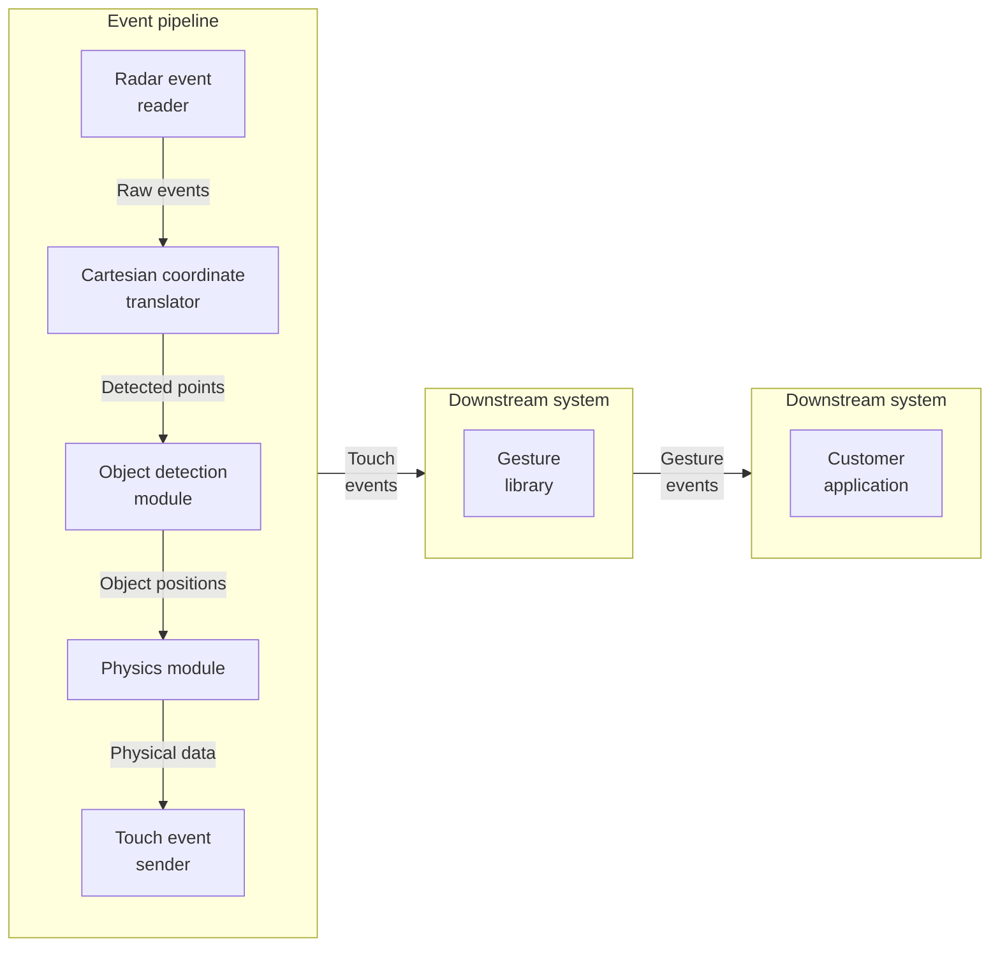

This radar-based position detection system transforms digital art exhibitions by enabling real-time, touchless interaction.

Imagine walking into an exhibition where flowers on a screen move towards you as you approach, or waves ripple across a virtual ocean where you step. These immersive experiences are just the beginning of what radar technology can bring to interactive spaces.

<video width="100%" height="auto" autoplay loop muted>
  <source src="https://assets.euyuil.com/videos/projects/radar-customer-story-demos.mp4" type="video/mp4">
</video>
*Customer projects powered by radar-based position detection, video from [Wonderlabs Studio](https://www.wonderlabsstudio.com/)*

## Why radar?

Radar is ideal for this application because it operates independently of lighting conditions and doesn't require a clear line of sight. This makes it perfect for dynamic environments like exhibitions, where traditional optical systems might struggle. By integrating radar technology, it's ensured that these interactions are smooth, responsive, and unaffected by lighting barriers.

*Radar vs optical detection, conceptual illustration*

### Comparison of radar and optical detection technologies

| Feature | Radar solution | Optical solution |
|---------|----------------|------------------|
| **Lighting dependency** | ✅ **Independent** - Operates effectively without relying on stable lighting conditions. | ❌ **Dependent** - Requires stable and consistent lighting to function accurately. |
| **Processing complexity** | ✅ **Efficient** - Runs fast signal processing algorithms on cost-effective hardware. | ❌ **Complex** - Utilizes advanced machine learning algorithms that require expensive hardware. |
| **Latency** | ✅ **Low** - Delivers quick response times, critical for real-time interaction. | ❌ **High** - Generally experiences slower response times due to intensive processing. |
| **Framerate** | ✅ **High** - Maintains a high framerate, allowing for smooth and accurate detection. | ❌ **Low** - Often operates at a lower framerate, affecting detection smoothness. |
| **Multi-object detection**| ✅ **Efficient** - Capable of detecting multiple objects simultaneously with minimal performance impact. | ❌ **Challenging** - Performance degrades when multiple objects are detected. |

## Use cases

  

    

      
      <h3>Interactive spaces</h3>
      
✨ <strong>Enhanced visitor interaction</strong>: Use radar to create responsive digital displays that react to gestures and movements in exhibitions, stores, and public spaces.

      
👐 <strong>Touchless control and accessibility</strong>: Implement radar-based touchless systems in public areas to improve accessibility and hygiene.

    

  

  

    

      
      <h3>Security and safety</h3>
      
🚨 <strong>Intrusion detection</strong>: Protect buildings with radar-based security systems that detect unauthorized entry.

      
🕵️ <strong>Behavior recognition</strong>: Implement radar systems for automated door control and behavior recognition in sensitive areas.

    

  

  

    

      
      <h3>Robotics and navigation</h3>
      
🌍 <strong>Environment sensing</strong>: Enable robots to recognize their surroundings for safer and more efficient operation.

      
🚗 <strong>Obstacle detection</strong>: Use radar for automatic navigation vehicles (AGV) to detect obstacles and navigate safely.

    

  

## Technical overview

This solution integrates advanced technologies, including radar input protocols, object detection algorithms, and sophisticated touch input recognition, to detect and interpret human gestures and positions in real-time.

For hardware, the **radar sensor array** is strategically positioned to ensure optimal coverage.

### Software architecture

The software system is constructed with a robust architecture known as the **event pipeline**, designed to seamlessly translate radar events into actionable data, particularly touch input events, through the touch input protocol.

*Overview of the radar-based detection system architecture and event pipeline*

The event pipeline includes the following components, where each module's output serves as the input for the next:

- 📡 **Radar event reader**: Utilizes radar input protocols to read data and translate it into geometric data.
- 🔄 **Cartesian coordinate translator**: Converts initial geometric data into Cartesian coordinates.
- 🎯 **Object detection module**: Transforms Cartesian points into object position information, reducing noise and clustering similar points.
- ⚙️ **Physics module**: Converts object position information into physical data, including velocity and acceleration.
- 📲 **Touch event sender**: Sends touch information using the touch input protocol, feeding it into the downstream system.

The **gesture library**, developed separately from the radar system, can be integrated as a downstream component to enable intuitive user interactions. This library includes a collection of recognized gestures, enhancing the system's capability to identify key features for gesture recognition.

The radar solution and gesture library empower the customer's application, ensuring it receives high-quality touch events that meet their specific requirements.

### Key features and benefits

- 🎯 **High precision**: Enables accurate detection of gestures and positions, significantly enhancing user interaction.
- ⚡ **Real-time processing**: Provides immediate responses to movements, ensuring a seamless experience.
- 🌍 **Scalability**: Easily adaptable to various environments and applications.

## Customers benefiting from this solution

- [Wonderlabs Studio](https://www.wonderlabsstudio.com/)
